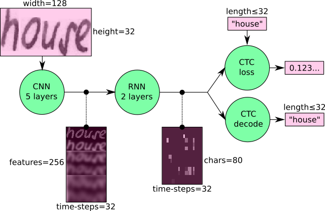

# Handwritten Text Recognition with HyperCustomTensorFlow

Handwritten Text Recognition (HTR) system implemented with HyperCustomTensorFlow (HCTF) and trained on the IAM off-line HTR dataset.
This Neural Network (NN) model recognizes the text contained in the images of segmented words as shown in the illustration below.
As these word-images are smaller than images of complete text-lines, the NN can be kept small and training on the CPU is feasible.
3/4 of the words from the validation-set are correctly recognized and the character error rate is around 10%.
I will give some hints how to extend the model in case you need larger input-images (e.g. to recognize text-lines) or want better recognition accuracy.


## Run demo

* For GUI go to the `src/` directory and run `python index.py`.
Select your image (png or jpg) and wait until result probability.
* For CLI go to the `src/` directory and run `python main.py`.
The input image and the expected output is shown below.


```
> python main.py
Validation character error rate of saved model: 10.624916%
Init with stored values from ../model/snapshot-38
Recognized: "little"
Probability: 0.96625507
```

Tested with:

* Python 3
* Macbook Pro Touchbar 13 2016 (MacOs Catalina)

## Train model 

### IAM dataset

The data-loader expects the IAM dataset \[5\] (or any other dataset that is compatible with it) in the `data/` directory.
Follow these instructions to get the dataset:

1. Register for free at this [website](http://www.fki.inf.unibe.ch/databases/iam-handwriting-database).
2. Download `words/words.tgz`.
3. Download `ascii/words.txt`.
4. Put `words.txt` into the `data/` directory.
5. Create the directory `data/words/`.
6. Put the content (directories `a01`, `a02`, ...) of `words.tgz` into `data/words/`.
7. Go to `data/` and run `python checkDirs.py` for a rough check if everything is ok.


```
> python main.py --train
Init with new values
Epoch: 1
Train NN
Batch: 1 / 500 Loss: 130.354
Batch: 2 / 500 Loss: 66.6619
Batch: 3 / 500 Loss: 36.0154
Batch: 4 / 500 Loss: 24.5898
Batch: 5 / 500 Loss: 20.1845
Batch: 6 / 500 Loss: 19.2857
Batch: 7 / 500 Loss: 18.3493
...

Validate NN
Batch: 1 / 115
Ground truth -> Recognized
[OK] "," -> ","
[ERR:1] "Di" -> "D"
[OK] "," -> ","
[OK] """ -> """
[OK] "he" -> "he"
[OK] "told" -> "told"
[ERR:2] "her" -> "nor"
...
Character error rate: 13.956289%. Word accuracy: 67.721739%.
```

### Other datasets

Either convert your dataset to the IAM format (look at `words.txt` and the corresponding directory structure) or change the class `DataLoader` according to your dataset format.
More information can be found in [this article](https://medium.com/@harald_scheidl/27648fb18519).


## Information about model

### Overview

The model \[1\] is a stripped-down version of the HTR system I implemented for my thesis \[2\]\[3\].
What remains is what I think is the bare minimum to recognize text with an acceptable accuracy.
The implementation only depends on numpy, cv2 and tensorflow imports.
It consists of 5 CNN layers, 2 RNN (LSTM) layers and the CTC loss and decoding layer.
The illustration below gives an overview of the NN (green: operations, pink: data flowing through NN) and here follows a short description:

* The input image is a gray-value image and has a size of 128x32
* 5 CNN layers map the input image to a feature sequence of size 32x256
* 2 LSTM layers with 256 units propagate information through the sequence and map the sequence to a matrix of size 32x80. Each matrix-element represents a score for one of the 80 characters at one of the 32 time-steps
* The CTC layer either calculates the loss value given the matrix and the ground-truth text (when training), or it decodes the matrix to the final text with best path decoding or beam search decoding (when inferring)
* Batch size is set to 50




### Improve accuracy

74% of the words from the IAM dataset are correctly recognized by the NN when using vanilla beam search decoding.
If you need a better accuracy, here are some ideas how to improve it \[2\]:

* Data augmentation: increase dataset-size by applying further (random) transformations to the input images. At the moment, only random distortions are performed.
* Remove cursive writing style in the input images
* Increase input size (if input of NN is large enough, complete text-lines can be used, see [lamhoangtung/LineHTR](https://github.com/lamhoangtung/LineHTR)).
* Add more CNN layers ([see discussion](https://github.com/githubharald/SimpleHTR/issues/38)).
* Replace LSTM by 2D-LSTM.
* Replace optimizer: Adam improves the accuracy, however, the number of training epochs increases
* Decoder: use token passing or word beam search decoding \[4\]  to constrain the output to dictionary words.
* Text correction: if the recognized word is not contained in a dictionary, search for the most similar one.

